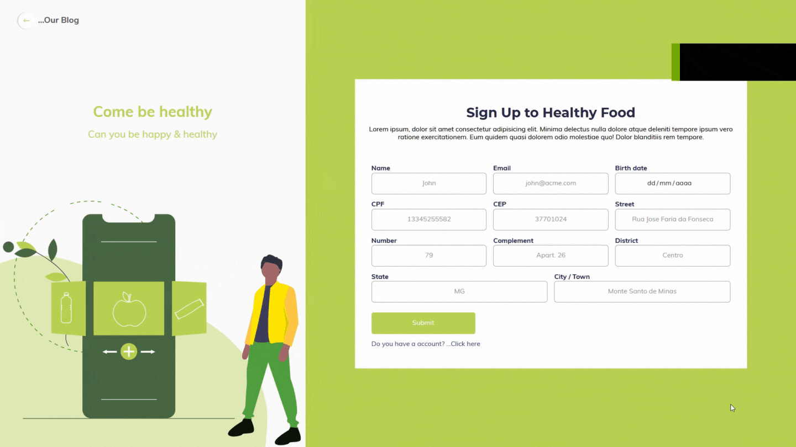

# Healthy Food - React APP

Este é um desafio proposto pela GCB Investimentos para uma vaga front-end, a proposta é desenvolver uma aplicação a partir de um protótipo feito no adobe XD. O site deve ser todo responsivo, e também deveria ser implementado uma tela de cadastro, onde os dados seriam armazenados no Local Storage.

## Resultado

Esta é uma amostra de como ficou a landing page >>

Esta é uma amostra de como ficou o formulário >>

## Para baixar  && executar o projeto

Com o git instalado, execute no seu terminal o comando 

`git clone https://github.com/AdilsonOliveira37/desafio-gcb`

Com o gerenciador de pacotes Yarn instalado, execute o comando

`yarn start`

#### E Prontinho o Healthy Food estará executando em sua maquina

# 

## Leia mais sobre React-js

You can learn more in the [Create React App documentation](https://facebook.github.io/create-react-app/docs/getting-started).

To learn React, check out the [React documentation](https://reactjs.org/).
